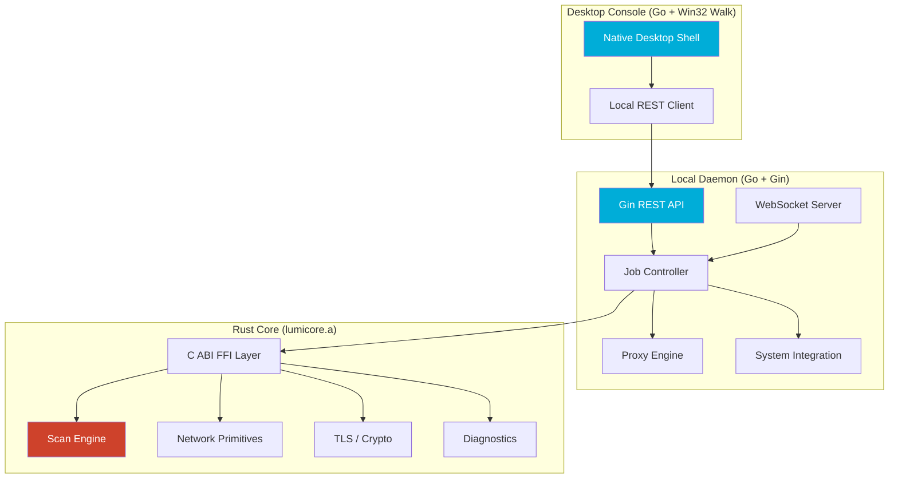

<div align="center">

# 🌐 LumiNet

### Native Network Operations Console

*A high-performance, multi-language network diagnostic, scanning, proxy testing, and system management platform.*

[](https://www.rust-lang.org/)
[](https://go.dev/)
[](LICENSE)

---

**Illuminate Your Network**

[Quick Start](file:///D:/GitHub/LumiNet/docs/guides/quickstart.md) · [Features](file:///D:/GitHub/LumiNet/PRODUCT.md) · [Architecture](file:///D:/GitHub/LumiNet/docs/WIKI.md#chapter-2-platform-architecture--multi-language-runtime) · [CLI Reference](file:///D:/GitHub/LumiNet/docs/guides/cli-reference.md) · [Development](file:///D:/GitHub/LumiNet/docs/guides/development.md) · [Design System](file:///D:/GitHub/LumiNet/design-system/luminet/MASTER.md)

</div>

---

## ✨ Overview

LumiNet is a local network dashboard, proxy testing suite, and system configuration cockpit designed for power users, developers, and privacy-conscious researchers operating in restricted or monitored network environments. Built with a high-performance Rust scanning engine (`lumicore`) linked statically into a Go daemon, it provides transparent, raw network instrumentation without relying on external cloud databases or paid SaaS dependencies.

---

## 🚀 Key Subsystems & Features

### 🔍 1. LumiScan — High-Performance Scanning
*   **ICMP Sweep:** Concurrent subnet sweep utilizing high-precision async sockets. Includes rate limiting, adaptive timeouts, and raw RTT calculations.
*   **TCP Port Sweep:** Discovers open ports, issues raw socket connect checks, and performs service banner grabbing (parsing SSH headers, HTTP Server banners, SSL fingerprints).
*   **DNS Record Harvesting:** Retrieves records (`A`, `AAAA`, `CNAME`, `MX`, `TXT`, `NS`) from multiple recursive resolvers simultaneously.
*   **TLS Certificate Inspector:** Initiates standard TLS handshakes, parses the remote certificate chain, checks expiration, evaluates certificate trust paths, and lists supported SSL/TLS cipher suites.
*   **SNI Reachability Probe:** Sends a custom ClientHello containing a target Server Name Indication (SNI) header to verify if local firewalls filter the domain.

### 🛡️ 2. LumiGuard — Integrity Auditing & Detection
*   **DNS Poisoning Detector:** Queries hostnames via standard UDP (port 53) and encrypted DNS-over-HTTPS (DoH) side-by-side to identify local DNS hijacking.
*   **Man-in-the-Middle (MITM) Auditor:** Evaluates SSL certificate issuers during HTTPS handshakes against local trust roots. Flags instances where known enterprise SSL decryption firewalls have intercepted connection packets.
*   **Forced SafeSearch Redirection Auditor:** Automatically inspects DNS resolutions for major search engines (Google, Bing, YouTube) and alerts the user of gateway CNAME redirection filtering.
*   **Windows NCSI Overrides:** Allows users to override active Windows Network Connectivity Status Indicator (NCSI) registry keys to bypass fake "No Internet Access" indicators caused by local ISP blockages of Microsoft's validation domains.
*   **CAPTCHA Bypass Integration:** Integrates 2Captcha APIs to extract sitekeys (`SITEKEY`) from Cloudflare Turnstile, hCaptcha, and Google reCAPTCHA challenges encountered during proxy subscription downloads.
*   **SOCKS5 UDP Associate NAT Mapper:** Employs UDP mapping diagnostics for gaming consoles and STUN servers. Bridges incoming SOCKS5 UDP packets, maintaining a 120-second active NAT translation state to avoid session disconnects over strict firewall gates.

### ⚡ 3. Active Evasion & Circumvention Layers
The active evasion suite manipulates TCP packets and streams in user-space to bypass DPI firewalls:
*   **TCP Segment Splitting & Delay:** Slices initial connection streams at custom byte boundaries (e.g., offset 3) and delays subsequent segments by a configurable interval (in milliseconds) to interrupt signature extraction.
*   **Auto-Split TLS SNI (Smart Evasion):** Strips the TLS ClientHello header, parses SNI extensions automatically, and splits the TCP segment exactly at the SNI payload string boundary, preventing signature-matching engines from parsing hostnames.
*   **Userspace Raw Handshake Injection (paqet mode):** Bypasses the standard OS TCP 3-way handshake to prevent tracking. Injects custom `PSH-ACK` buffers via raw sockets. Uses `WinDivert` on Windows and `AF_PACKET` on Linux to drop host-generated kernel `RST` packets, keeping the stream active exclusively in user-space.
*   **Plaintext HTTP Header Mutation:** Mutates standard headers (e.g. `Host: google.com` -> `hOsT: google.com` or `Host  : google.com`) to cause deep packet parsing failures in legacy firewalls.
*   **Range-Based Fragmentation:** Divides outgoing packets into random chunk sizes (between `minLength` and `maxLength`) with a customizable write delay (`delayMs`) to randomize traffic fingerprints.

### 🌐 4. Outbound Connection Wrappers
*   **Netrix KCP Performance Profiles:** Predefined, runtime performance optimization profiles (`balanced`, `aggressive`, `latency`, `cpu-efficient`) mapped directly to KCP transport setups.
*   **Netrix Obfuscated Stream:** Employs a custom KCP connection wrapper (`NetrixConn`) that compresses stream data frames using LZ4 or Zstandard block framing compression and introduces random timing jitter to scramble fingerprint signatures.
*   **DNS Active Resolver Scanner:** Audits recursive DNS servers by initiating parallel DNS queries containing random subdomains targeting destination resolvers. This forces recursive servers to forward queries to authoritative nodes rather than answering from cache, validating end-to-end DNSTT/Slipstream path latency and availability.
*   **Covert Telemetry IP Tracker:** Serves dynamic decoy HTTP web pages for unauthenticated scanner hits. Logs incoming visit events in SQLite databases (`covert_links` and `covert_visits`), capturing telemetry metrics (User-Agent header parsed into OS/browser/device type classifications, client IP, and GeoIP metadata). Exposes CRUD endpoints (`/api/system/covert`) protected by secure API headers to manage links and inspect visit metrics.
*   **Zephyr Google Drive Transport:** Bridges outbound proxy connections over Google Drive file uploads. Clients write connection data into structured files and poll GDrive directories to retrieve responses. It optionally wraps connection frames in binary envelopes prepended with MagicBytes (`0x1F`), SessionID, Sequence, and payload length descriptors.

---

## 🏗️ Architecture

LumiNet compiles to a statically linked multi-language application:



> **FFI Design:** Rust compiles to a static library (`liblumicore.a` / `lumicore.lib`). Go consumes it using CGO, bridging Rust's low-level packet crafting logic with Go's high-level application orchestration.

For detailed architecture documentation, see the [Architecture Overview](file:///D:/GitHub/LumiNet/docs/WIKI.md#chapter-2-platform-architecture--multi-language-runtime).

---

## 🛠️ Build from Source

### Prerequisites
The Go server uses CGO to link against the Rust core. You **must** have a valid C compiler toolchain installed and in your system `PATH`.

*   **Windows:** Install [MSYS2](https://www.msys2.org/) and execute: `pacman -S mingw-w64-x86_64-gcc`
*   **Linux:** Install via apt: `sudo apt install build-essential`
*   **macOS:** Install Xcode Command Line Tools: `xcode-select --install`

### Compilation Commands
```bash
# Clone the repository
git clone https://github.com/maybeknott/luminet.git
cd LumiNet

# Windows Compilation (PowerShell)
.\scripts\build-all.ps1 -SkipWeb

# Unix Compilation (Linux / macOS)
chmod +x scripts/build-all.sh
./scripts/build-all.sh --skip-web
```

---

## 💻 Documentation Index

For details on configuration and development, consult the guides listed below:

*   **[Quick Start Guide](file:///D:/GitHub/LumiNet/docs/guides/quickstart.md)** — Installation, CLI examples, daemon configurations, and disaster recovery runbooks.
*   **[Developer & Technical Manual](file:///D:/GitHub/LumiNet/docs/guides/development.md)** — ABI boundaries, SQLite schema documentation, evasion tunnel mechanics, and compilation troubleshooting.
*   **[Native Desktop Console](file:///D:/GitHub/LumiNet/docs/guides/native-ui.md)** — Guide to Walk UI tabs, canvas rendering, and Windows manifest configurations.
*   **[CLI Reference Manual](file:///D:/GitHub/LumiNet/docs/guides/cli-reference.md)** — Detailed flags and usage examples for all subcommands.
*   **[Product Specification](file:///D:/GitHub/LumiNet/PRODUCT.md)** — System requirements, pillars, and target personas.
*   **[Design System Master](file:///D:/GitHub/LumiNet/design-system/luminet/MASTER.md)** — Styling tokens, CSS patterns, and aesthetic principles.
*   **[Technical Wiki Handbook](file:///D:/GitHub/LumiNet/docs/WIKI.md)** — Canonical Wiki containing product visions and system operations guides.
